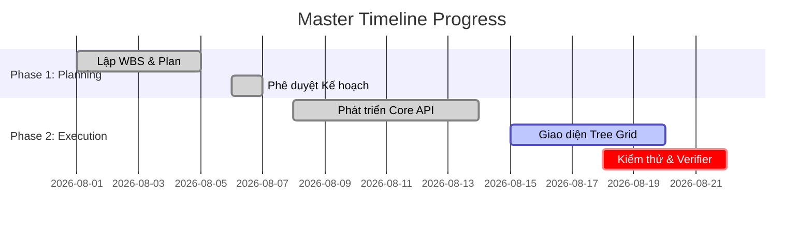

# Artifact Reports — Skill Tạo Báo Cáo Tiến Độ Tự Động

## Overview
Skill này quy định định dạng đầu ra chuẩn cho các báo cáo tiến độ dự án (Progress Reports) được xuất bản dưới dạng **Artifacts Markdown** trong Antigravity. Báo cáo bao gồm bảng KPI tổng quan, sơ đồ tiến độ trực quan (Mermaid Gantt), chi tiết bảng WBS status, và ma trận đánh giá rủi ro.

---

## 📄 Template Báo Cáo Tiến Độ Chuẩn (Standard Progress Report)

Báo cáo phải được ghi ra tệp Artifact Markdown (ví dụ: `progress_report_2026_08_17.md` hoặc `walkthrough.md`) với cấu trúc tiêu chuẩn như sau:

```markdown
# 📈 BÁO CÁO TIẾN ĐỘ DỰ ÁN (PROGRESS REPORT)
**Ngày báo cáo**: YYYY-MM-DD | **Dự án**: [Tên Dự Án] | **Tác giả**: Antigravity AI Tracker

---

## 📊 1. Thống Kê Tổng Quan (Executive Summary)

| Chỉ Số (Metric) | Giá Trị (Value) | Trạng Thái |
|-----------------|-----------------|------------|
| **Tổng số Task** | 24 Tasks | 🟢 Bình thường |
| **Đã hoàn thành** | 18 / 24 (75%) | 🟢 Đúng kế hoạch |
| **Đang thực hiện** | 4 / 24 (16%) | 🟡 Cần chú ý |
| **Trễ hạn / Bị nghẽn** | 2 / 24 (9%) | 🔴 Cảnh báo rủi ro |
| **Milestone tiếp theo** | Launch Beta (2026-08-25) | ⏳ Còn 8 ngày |

---

## 🗓️ 2. Biểu Đồ Tiến Độ (Gantt Chart Visual)



---

## 📑 3. Chi Tiết Tiến Độ WBS (WBS Status Detail)

| Mã WBS | Tên Công Việc | Người Trách Nhiệm (PIC) | % Hoàn Thành | Trạng Thái | Ghi Chú / Verification |
|--------|---------------|--------------------------|--------------|------------|------------------------|
| `WBS-1.1` | Thiết kế DB Schema | Dev Lead | 100% | 🟢 Done | Migrations verified |
| `WBS-1.2` | Tích hợp Gantt UI | Frontend Dev | 60% | 🟡 In Progress | Giao diện cơ bản xong |
| `WBS-1.3` | Import MS Project XML | Backend Dev | 30% | 🔴 Delayed | Gặp lỗi parse XML node |

---

## ⚠️ 4. Ma Trận Đánh Giá Rủi Ro & Đề Xuất (Risk Matrix)

> [!WARNING]
> **Rủi ro Trễ hạn Mốc `WBS-1.3`**: Task import XML bị trễ 2 ngày so với baseline.
> - **Nguyên nhân**: Cấu trúc XML từ MS Project v2026 có thêm namespace mới.
> - **Giải pháp khắc phục**: Cập nhật parser trong `xml-parser.ts`, bổ sung unit test case cho XML v2026.
```

---

## 🎨 Quy Tắc Trình Bày Visual
1. **Dùng Mermaid**: Luôn kèm sơ đồ Mermaid Gantt hoặc Mermaid Flowchart để trực quan hóa tiến độ.
2. **Alert Blocks**: Dùng GitHub Alerts (`> [!NOTE]`, `> [!IMPORTANT]`, `> [!WARNING]`, `> [!CAUTION]`) để tạo điểm nhấn trực quan.
3. **Artifact Link**: Đảm bảo tệp báo cáo được tạo thành công trong danh mục Artifacts để người dùng xem nhanh.
