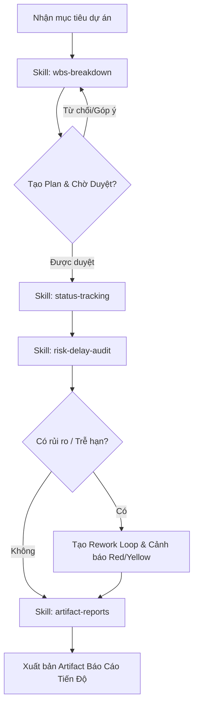

# Project Tracker — Suite Theo Dõi Tiến Độ Dự Án

## Overview
Skill tổng hợp điều phối toàn bộ quy trình theo dõi, cập nhật tiến độ và quản lý rủi ro cho dự án trong môi trường Google Antigravity. Skill này liên kết 4 nhóm kỹ năng chuyên biệt:

1. **WBS Breakdown (`wbs-breakdown`)**: Lập kế hoạch, chia nhỏ công việc và chờ duyệt.
2. **Status Tracking (`status-tracking`)**: Quét dữ liệu thực tế và đối chiếu tiến độ.
3. **Artifact Reports (`artifact-reports`)**: Xuất báo cáo tự động dạng bảng & biểu đồ.
4. **Risk & Delay Audit (`risk-delay-audit`)**: Kiểm toán rủi ro, gắn nhãn trễ hạn và đề xuất giải pháp.

---

## Workflow Điều Phối

---

## 🛠️ Quy Trình Thực Hiện

### 1. Phân Rã Kế Hoạch (Planning Phase)
Khi nhận một mục tiêu lớn, **BẮT BUỘC** gọi skill `wbs-breakdown`:
- Chia nhỏ thành Task Groups, Milestones, và Tasks chi tiết.
- Xuất file kế hoạch `implementation_plan.md` với `request_feedback = true`.
- **KHÔNG THỰC THI CHÍNH THỨC** trước khi nhận phản hồi phê duyệt từ NSD.

### 2. Theo Dõi & Quét Tiến Độ (Sync Phase)
Thường xuyên gọi skill `status-tracking` để:
- Quét các file tài nguyên trong workspace: `git log`, file Markdown status, báo cáo công việc, kết quả test.
- Tính toán tỷ lệ % hoàn thành thực tế so me với baseline ban đầu.

### 3. Kiểm Toán Rủi Ro & Chậm Tiến Độ (Audit Phase)
Gọi skill `risk-delay-audit` để đánh giá:
- Cảnh báo **🔴 ĐỎ**: Task trễ > 2 ngày hoặc thiếu bằng chứng xác minh (verification evidence).
- Cảnh báo **🟡 VÀNG**: Task còn < 24h mà % hoàn thành < 50%.
- Đề xuất phương án khắc phục (rework loops, điều chỉnh nguồn lực).

### 4. Báo Cáo Tự Động (Reporting Phase)
Sử dụng skill `artifact-reports` để:
- Tổng hợp Dashboard tiến độ dưới dạng Artifact Markdown.
- Tạo biểu đồ Mermaid Gantt, bảng thống kê KPI và ma trận rủi ro.

---

## 🔴 Quy Tắc Cốt Lõi (Iron Rules)
1. **No Unapproved Execution**: Luôn lập bản Plan và nhận sự đồng ý trước khi triển khai các thay đổi lớn.
2. **Evidence Before Status**: Trạng thái "Hoàn thành" chỉ được công nhận khi có kết quả verify (test pass, log xác thực).
3. **Transparent Alerting**: Phải báo cáo công khai các điểm nghẽn (blockers) ngay khi phát hiện.
