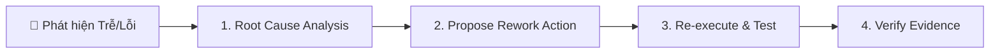

# Risk & Delay Audit — Skill Kiểm Toán & Cảnh Báo Rủi Ro

## Overview
Skill này thiết lập cơ chế tự động kiểm toán tiến độ, phát hiện các nguy cơ trễ hạn (Delays), thiếu bằng chứng kiểm thử (Unverified Work), và đề xuất các chu trình khắc phục (Rework Loops) để đưa dự án trở lại đúng quỹ đạo Master Timeline.

---

## 🚨 Ngưỡng Cảnh Báo Rủi Ro (Audit Thresholds)

Mỗi công việc trong WBS sẽ được tự động đánh giá và gán nhãn theo 3 mức độ:

### 🔴 MỨC ĐỎ (CRITICAL / HIGH RISK)
Gán nhãn **🔴 RED ALERT** nếu vi phạm 1 trong các điều kiện:
- **Trễ hạn > 2 ngày**: Task đã vượt quá `endDate` hoặc thời lượng ước tính quá 2 ngày làm việc.
- **Unverified Completion**: Task được đánh dấu là hoàn thành (100% / Done) nhưng KHÔNG CÓ bằng chứng nghiệm thu (không có log test pass, thiếu file kết quả, hoặc lệnh verify bị lỗi).
- **Critical Path Blocker**: Task nằm trên đường găng (Critical Path) bị nghẽn làm ảnh hưởng toàn bộ Milestone kế tiếp.

### 🟡 MỨC VÀNG (WARNING / MEDIUM RISK)
Gán nhãn **🟡 YELLOW WARNING** nếu:
- Task còn < 24 giờ tới hạn nhưng tiến độ thực tế mới đạt < 50%.
- Có sự thay đổi về yêu cầu (scope creep) nhưng chưa được cập nhật vào WBS Baseline.

### 🟢 MỨC XANH (NORMAL / ON TRACK)
Gán nhãn **🟢 GREEN**: Đúng tiến độ, đã verify đầy đủ bằng chứng.

---

## 🔄 Chu Trình Khắc Phục (Rework Loops Protocol)

Khi phát hiện một Task rơi vào Mức Đỏ (🔴), AI **BẮT BUỘC** đề xuất chu trình Rework Loop gồm 4 bước:



### Các Phương Án Đề Xuất Khắc Phục Standard:
1. **Phân rã lại (Sub-breakdown)**: Chia nhỏ task bị nghẽn thành các sub-task cực nhỏ để giải quyết từng phần.
2. **Nén tiến độ (Fast-Tracking / Crashing)**: Chuyển các công việc từ nối tiếp (FS) sang song song (SS/FF) nếu không có sự ràng buộc cứng.
3. **Thêm bằng chứng Verification**: Chạy lại lệnh build/test để chụp lại log bằng chứng hoàn thành.

---

## 📋 Mẫu Bảng Kiểm Toán Rủi Ro (Audit Log Template)

```markdown
# 🛡️ AUDIT LOG: KIỂM TOÁN RỦI RO TIẾN ĐỘ

| Mã Task | Tên Công Việc | Mức Độ Rủi Ro | Lý Do Cảnh Báo | Hành Động Khắc Phục (Rework Action) |
|---------|---------------|---------------|----------------|--------------------------------------|
| `WBS-2.3` | Integration API | 🔴 CRITICAL | Trễ 3 ngày & thiếu test pass | Chạy lại test suite, sửa bug auth header |
| `WBS-3.1` | Build Production | 🟡 WARNING | Còn 12h, tiến độ 40% | Tập trung nguồn lực xử lý xong trong ngày |
| `WBS-1.1` | DB Schema | 🟢 OK | Đúng hạn, test pass | Không cần thao tác |
```
