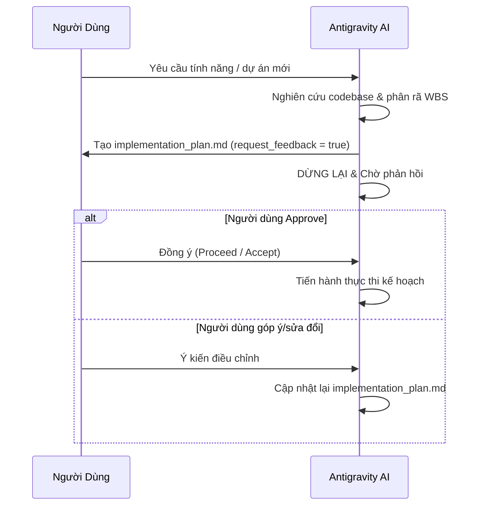

# WBS Breakdown — Skill Lập Kế Hoạch & Phân Rã Công Việc

## Overview
Skill này quy định phương pháp chia nhỏ một mục tiêu/dự án lớn thành cấu trúc cây WBS (Work Breakdown Structure) bao gồm **Task Groups**, **Milestones**, và **Tasks/Sub-tasks**. Đồng thời bắt buộc AI phải thiết lập **Implementation Plan** và chờ sự đồng ý (Accept) của người dùng trước khi tiến hành thực thi.

---

## 📐 Quy Tắc Phân Rã WBS

### 1. Phân Cấp WBS Standard
- **Cấp 1 — Group / Phase**: Các giai đoạn chính của dự án (ví dụ: `1.0 Khởi tạo & Nghiên cứu`, `2.0 Thiết kế hệ thống`, `3.0 Triển khai Code`, `4.0 Kiểm thử & Nghiệm thu`).
- **Cấp 2 — Milestone / Major Deliverable**: Mốc hoàn thành quan trọng có mốc thời gian rõ ràng (ví dụ: `2.1 Chốt thiết kế DB schema`, `3.1 Hoàn thành Module Authentication`).
- **Cấp 3 — Task**: Công việc thực thi cụ thể có người phụ trách (PIC), thời lượng ước tính (Days/Hours) và tiêu chí nghiệm thu (Done Criteria).
- **Cấp 4 — Sub-task (Nếu cần)**: Các thao tác kỹ thuật nhỏ hơn cấu thành Task.

### 2. Mẫu Phân Rã Chuẩn
```markdown
# WBS: [Tên Dự Án / Feature]

## Group 1.0: [Tên Nhóm Công Việc 1]
- 🚩 **Milestone 1.1**: [Mốc tiến độ 1] (Target: YYYY-MM-DD)
  - 🔲 **Task 1.1.1**: [Tên công việc cụ thể]
    - PIC: [Tên/Vai trò] | Duration: [X] ngày | Dependencies: []
    - Criteria: [Tiêu chí xong]
  - 🔲 **Task 1.1.2**: [Tên công việc cụ thể]
    - PIC: [Tên/Vai trò] | Duration: [Y] ngày | Dependencies: [Task 1.1.1]

## Group 2.0: [Tên Nhóm Công Việc 2]
...
```

---

## 🚦 Quy Trình Plan-Then-Accept (Bắt Buộc)



### 🛑 Quy tắc nghiêm ngặt:
1. **Chưa duyệt = Chưa viết code**: KHÔNG sửa mã nguồn hoặc thực thi các lệnh thay đổi dữ liệu trước khi kế hoạch được bấm duyệt.
2. **Liệt kê rõ Dependency**: Xác định rõ ràng task nào phụ thuộc task nào (FS - Finish to Start, SS - Start to Start).
3. **Tiêu chí Hoàn Thành (Definition of Done)**: Mỗi task phải đi kèm phương án verification (Unit test, Integration test, Manual UI check).
